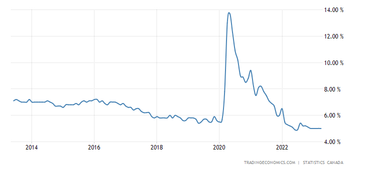
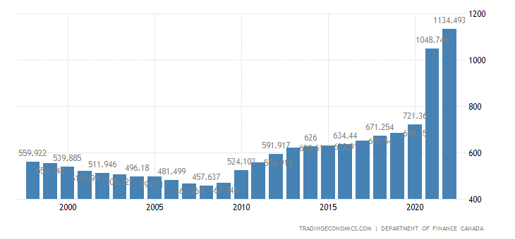
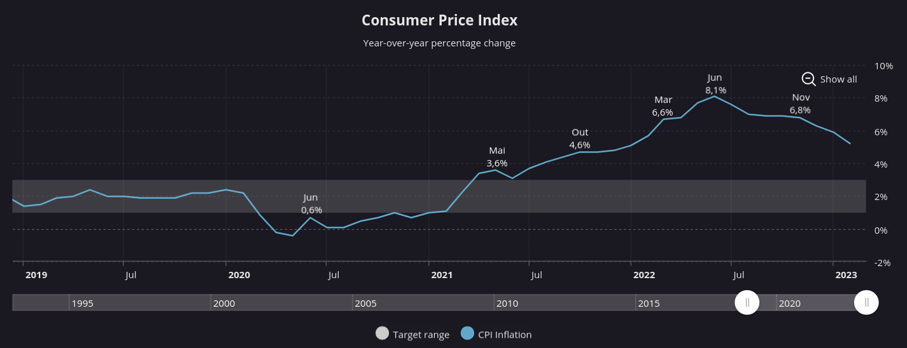

## Problemas atuais na economia canadense

### Envelhecimento da população

#### Consequências

* Diminuição da força de trabalho
* Aumento nos custos de saúde e previdência
* Menor produtividade
* Menos inovação e capacidade de adaptação

  Bem, um dos problemas atuais do Canadá se trata do envelhecimento da população, a população idosa está crescendo mais rápido que a de idade ativa, isso pode levar a um declínio na força de trabalho, aumento nos custos de saúde e previdência social, pode afetar negativamente a produtividade e crescimento econômico a longo prazo, pode haver menos inovação e capacidade de adaptação às mudanças econômicas.

### Dependência de recursos naturais

* 17% do PIB
* 1,8 milhões de empregos
* Preço do petróleo e preocupações ambientais
* Obstáculo do crescimento econômico

  Sobre a dependência de recursos naturais como petróleo e gás, a indústria dos recursos naturais é responsável por cerca de 17% do PIB e emprega aproximadamente 1,8 milhão de pessoas. Então a queda do preço do petróleo nos últimos anos afetou negativamente a economia, e também as preocupações ambientais e a transição para fontes de energia mais limpas fez com que a demanda por petróleo e gás diminuíssem. Então essa dependência pode ser um obstáculo para o crescimento econômico no longo prazo.

### Desemprego

* De 5,7% até 13,4%
* Home office
* Níveis semelhantes aos da década de 70
* Taxa atual de 5%
* Houve melhora
* Se encontra estável

  No ano de 2020 durante a pandemia houve um aumento enorme na taxa de desemprego vindo de taxas como 5,7% e chegando em maio a 13,4% e após isso veio se recuperando através do home office e tecnologias de trabalho remoto. Hoje a taxa de desemprego se encontra em níveis semelhantes aos da década de 70, atualmente em 5%, valor esse melhor que os valores de antes e durante a pandemia da COVID. Essa taxa encontrou estabilidade nessa mesma porcentagem em 5 meses e para se ter uma ideia numa média de cem mil pessoas apenas 5 mil estariam desempregadas.

### Dívida pública elevada

* 2022 - 1,134 trilhões de dólares canadenses
* Programas de estímulo econômico e medidas de apoio
* Gastos com saúde
* Queda na receita fiscal

#### Consequências

* Não haver cortes nos impostos
* Menos recursos aos serviços oferecidos aos contribuintes
* Aumento de impostos

  Os últimos dados divulgados sobre a dívida pública canadense de 2022 contém o valor de 1,134 trilhões de dólares canadenses. O crescimento da dívida durante a pandemia se deu por conta da implementação de programas de estímulo econômico, medidas de apoio, gastos com saúde e a queda da arrecadação de impostos. A crescente dívida pública não é um fenômeno novo no Canadá. Embora a dívida tenha crescido muito durante a pandemia, ela já estava aumentando muito antes. Esse aumento da dívida pública pode fazer com que não haja diminuição nos impostos e que menos recursos sejam direcionados para a saúde, educação entre outras áreas, podendo até haver um aumento nos impostos.

### Inflação

* Crescimento e recuperação da taxa de inflação

#### Fatores

* Escassez de produtos
* Alto preço de commodities
* Baixas taxas de juros

  É perceptível um crescimento da taxa de inflação canadense nos últimos 3 anos, que em junho de 2022 atingiu a marca de 8,1% e agora encontra-se em recuperação. Diversos fatores levaram ao aumento da inflação como: interrupção na cadeia de suprimentos que levou a uma escassez de produtos, alto preços das commodities que se deve em parte pela invasão da Ucrânia pela Rússia e taxas de juros baratas que impulsionaram as compras de imóveis.

